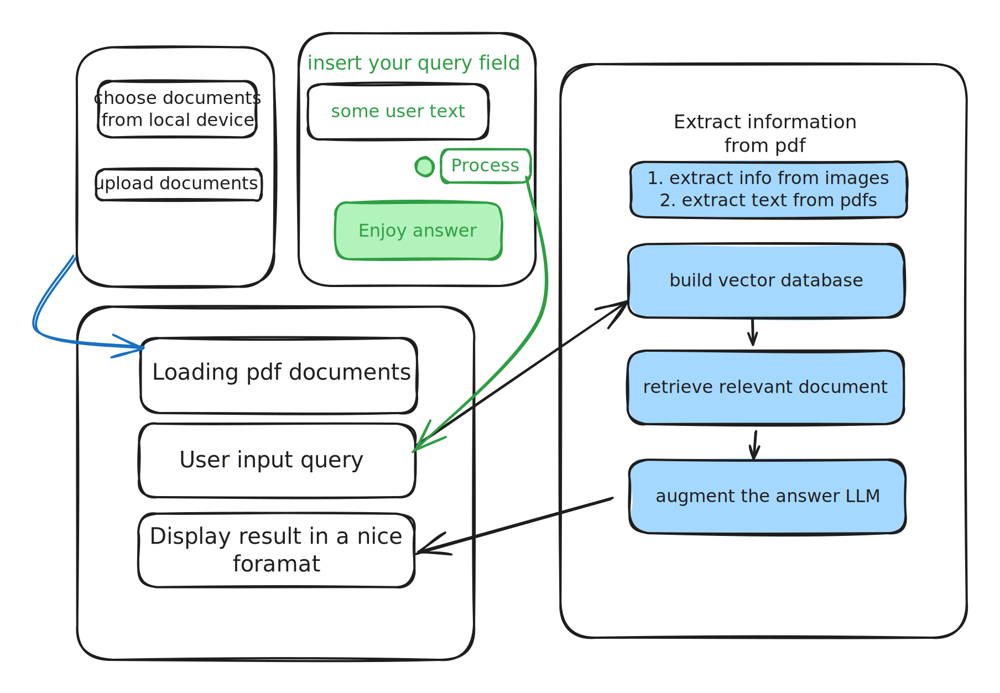

# Creating app for mozzila

First of all we need to separate task of frontend and backend team and insure their clear communication. Prototype needs to support minimal functionality displayed on the scheme below. This app is supposed to work as desktop local application and provide users with 2 bottoms:

1. user has to be able to load pdf documents from folder&#x20;
2. user has to be able to query this documents with questions and see the results

On the backеnd part these operations could be described as following:

1. When user press button "Upload documents" it triggers scripts which creates vector database
2. When user insert the query - it triggers script with b25 search in created database and LLM for answer generation based on retrieved documents. &#x20;


I think fronted part has to decide to the format in which we want to display the output, it might be a page with answer and links to the relevant documents. Now for simplicity I would suggest to use json format for communication with the fields:&#x20;

```python
answer_json = {
"text answer" : "some plain text with answer", 
"links": "links to the relevant documents" 
}
```


&#x20;&#x20;




[backend-development](creating-app-for-mozzila/backend-development/)


