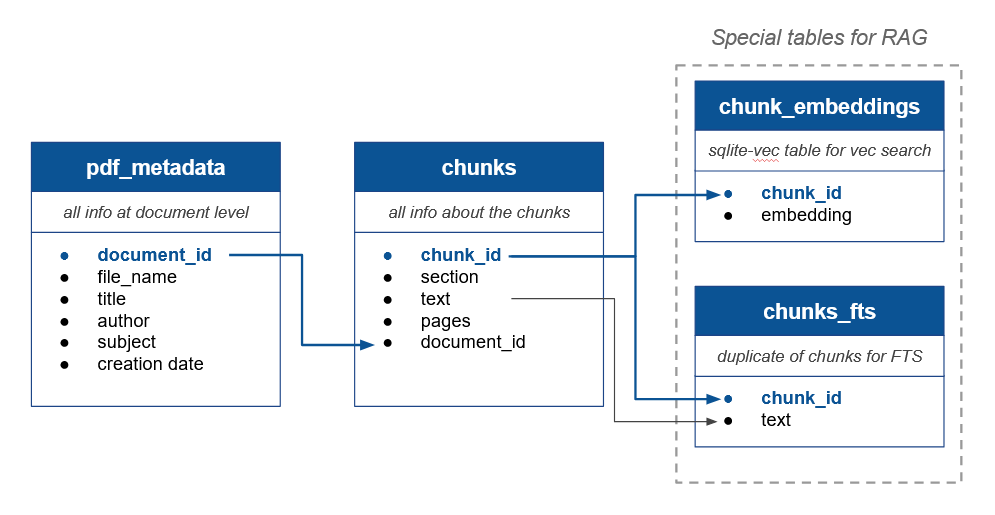

# Database

## Architecture

The data is stored in one database, in the /data folder

This database is made up of 2 main tables:

* _pdf\_metadata_ table, to store information at the pdf level (author, title, year...)
* _chunks_ table, to store the chunks before embedding and relevant informations regarding the chunks

The chunks table has 2 dependencies:

* _chunk\_embeddings_ table, in the vec0 format (sqlite vec), to store embeddings and allow vectorial search
* _chunks\_fts_ table, in the fts5 format, to allow for full text search

The overall architecture is the following:

<figure><figcaption></figcaption></figure>

## Pipeline

The process is discribed as follow. The main functions are _main.upload\_files_ and c_onnect\_db.parse\_pdf\_to\_db_

### A. Pdf parsing

#### 1. Pdf uploading

* &#x20;A pdf is added
* A copy of it is stored in app\_storage/pdf/to\_process

2. **Extraction of information from pdf**

See _pdf\_parsing\_pipeline.py_, and especially the _process\_pdf\_in\_folder_ function

For each pdf in the to\_process pipeline, 3 types of informations are extracted in a list of dictionnaries (or a .json file): document title, metadata, and the chunks

This is returned in a temporary file, that is later deleted

#### 3. Metadata storage

* All metadata information are stored in the _pdf\_metadata_ table, as well as the document title
* The _document\_id that was_ automatically incremented in the table is extracted

#### **4. Chunks storage**

* Each chunk is stored in the _chunks_ table, along with the _document\_id_ previously retrieved and other information
* All the _chunk\_ids_ automatically created for each chunk are extracted
* All the chunks text and chunk\_id are stored in the _chunks\_fts_ for later FTS&#x20;

#### **5. Embedding computing and storage**

* All the chunks that were stored are extracted again, using their chunk\_ids
* The embeddings are computed (_embedding.py / embed\_query)_&#x20;
* If the embedding is not in the right binary format for storage, a conversion is performed (_embedding.py / format\_for\_vec\_db_)
* Each embedding is stored in the _chunk\_embeddings_ table, along with its _chunk\_id_

#### 6. Final step

The processed pdf are moved from _pdfs/to\_process_ to _pdfs/processed_ to avoid being processed again

### 2. RAG

See RAG.py

#### 1. Extraction of the relevant documents

A list of documents the user wants to look at is passed

A temporary table containing only the chunks from the relevant documents is retrieved (necessary for sqlite grammar)

#### 2. RAG with hybrid search

The user query is embedding using the same embedding model as before

Hybrid search is performed following the reciprocal ranf fusion process described [here](https://alexgarcia.xyz/blog/2024/sqlite-vec-hybrid-search/index.html)

* The KNN vectors are retrieved from _chunk\_embeddings_ using vectorial search (for now, euclidean distance is used)
* The FTS (full term search) results are retrieved from _chunks\_fts_
* The results of the 2 approches are combined, and the chunks retrieved are enriched with relevant data (author, source article, etc)
