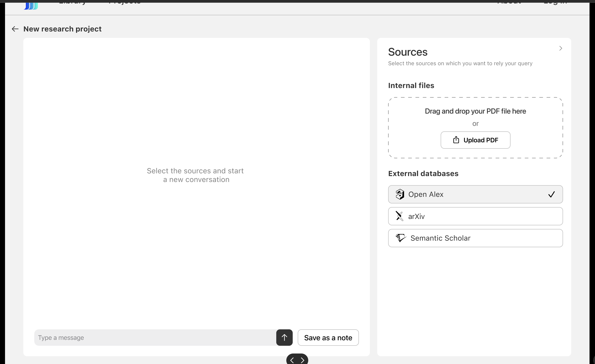

# PySide local app development&#x20;


Link for subprocess with PySide - the idea to hide from user ./llamafiles [https://www.pythonguis.com/tutorials/pyside6-qprocess-external-programs/](https://www.pythonguis.com/tutorials/pyside6-qprocess-external-programs/)

[https://www.youtube.com/watch?v=ySc5bCDkASg](https://www.youtube.com/watch?v=ySc5bCDkASg) -- how to implement ChutGpt with PyQt

How to test individual components , working with whole app might be a bit overwhelming, so if you want to load just part of it which you carrently work on , you can use the next example

[https://pastebin.com/2RBFQAEG](https://pastebin.com/2RBFQAEG)

the second example: you separately can develop Widget for example for displaying dialogs and then add it to corresponding field of all pipeline \
[https://pastebin.com/xnqF2CbF](https://pastebin.com/xnqF2CbF)\
\
So how I think we need to work everything out&#x20;

For example lets describe this page&#x20;

<figure><figcaption></figcaption></figure>

We have a lot of buttons here.&#x20;

For example upload pdf button - allows user to choose from local folders , adds this files to rag storage and displays the list of loaded files.&#x20;

Minimalistic example of such application would be btn.clicked.connect(self.launchDialog) connects this button to dialog and allows user select files. In overall pipeline ui files etc you can also find this button and connect this small component to global one .

<figure><figcaption></figcaption></figure>


```python
import sys
import os
from PySide6.QtWidgets import QApplication, QWidget, QVBoxLayout, QPushButton, QTextEdit, QFileDialog
from extract_pdf import extract_pdf_and_put_into_database


class MyApp(QWidget):
    def __init__(self):
        super().__init__()
        self.window_width, self.window_height = 800, 100
        self.setMinimumSize(self.window_width, self.window_height)

        layout = QVBoxLayout()
        self.setLayout(layout)

        # Create 'Upload' button and connect it to the file dialog
        btn = QPushButton('Upload pdf')
        btn.clicked.connect(self.launchDialog)
        layout.addWidget(btn)

        # Create a text edit box to display the selected file(s)
        self.textbox = QTextEdit()
        layout.addWidget(self.textbox)

    def launchDialog(self):
        self.getFileNames()

    def getFileNames(self):
        file_filter = 'Data File (*.pdf);;'
        response = QFileDialog.getOpenFileNames(
            parent=self,
            caption='Select file(s)',
            dir=os.getcwd(),
            filter=file_filter
        )
        file_names, _ = response
        extract_pdf_and_put_into_database(file_names)
        self.textbox.setText(str(response[0]))


if __name__ == '__main__':
    app = QApplication(sys.argv)
    app.setStyleSheet('''
        QWidget {
            font-size: 20px;
        }
    ''')

    myApp = MyApp()
    myApp.show()

    try:
        sys.exit(app.exec())
    except SystemExit:
        print('Closing Window...')

```

The same with a dialog , so if you want to display dialog&#x20;

```python
import json
import os
import sys
from PySide6.QtCore import Qt, Slot
from PySide6.QtWidgets import QApplication, QMainWindow, QGridLayout, QLabel, QListView
from PySide6.QtGui import QStandardItem, QStandardItemModel
from dialog_display import ChatDialog
from ui_forms_v1.ui_chat_window import Ui_MainWindow as ChatWindow
from ui_froms.reference_ui import Ui_Form as ReferenceForm
from connect_db import ConnectDB

from PySide6.QtWidgets import QWidget, QHBoxLayout, QPushButton, QLineEdit
from PySide6.QtGui import QIcon


from get_answer_from_api import get_response


class MainWindow(QMainWindow):
    def __init__(self):
        super().__init__()
        self.ui = ChatWindow()
        self.ui.setupUi(self)
        chat_data = [{"title": "Hi, how are you?",
                      "chat_list": [{"input_str": "Hi, how are you?", "out_str": "16 This is model answer"},
                                    {"input_str": "Good and you?", "out_str": "13 This is model answer"}, {
                                        "input_str": "Dark is a dark appearance that doesn\u2019t change. Dark Mode darkens the colour scheme so the content you\u2019re working on stands out, while windows and controls seem to recede into the background. It\u2019s effective for viewing documents, presentations, photos, films, web pages and more.",
                                        "out_str": "278 This is model answer"}]}][0]

        self.scrollArea_2 = self.ui.scrollArea_2
        self.show_chat_window(chat_data)

    def show_chat_window(self, chat_data):
        grid_layout = self.scrollArea_2
        dialog = ChatDialog(chat_data)
        grid_layout.setWidget(dialog)


if __name__ == "__main__":
    app = QApplication(sys.argv)

    # Create and show the main window
    main_window = MainWindow()
    main_window.show()

    sys.exit(app.exec())

```

this is a front part example for dialog, for backend part the next process is implemented:

we read the messege from message\_input part of front and give it to get responce function which returns references and response, we update our dialog dict with this new conversation and call display function to show the result. &#x20;

```python
dialog = ChatDialog(chat_data)
grid_layout.setWidget(dialog)
```

```python
    def get_response(self):
        message_input = self.message_input.toPlainText().strip()

        chat_db = self.connect_db.get_chat_data()

        if message_input:
            source_documents, response_str = get_response(message_input, debug=True)
            source_documents.append("attention is all you need.pdf")
            # Check if open a chat
            if self.ui.chat_list.selectedIndexes():
                # Get current selected chat index
                current_index = self.ui.chat_list.currentIndex()
                select_row = current_index.row()

                chat_db[select_row]["chat_list"] += [{"input_str": message_input, "out_str": response_str}]
```

