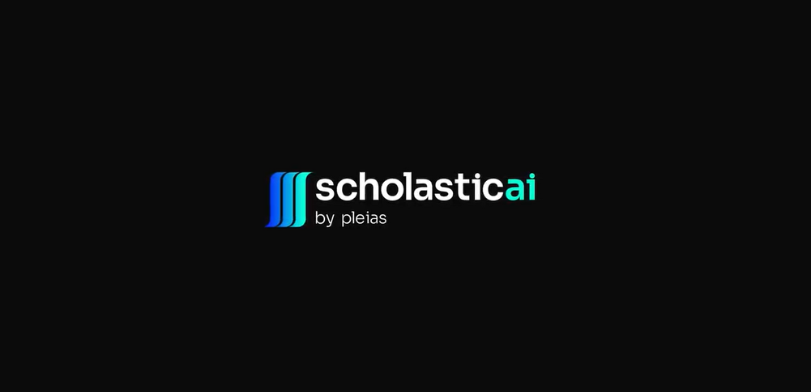
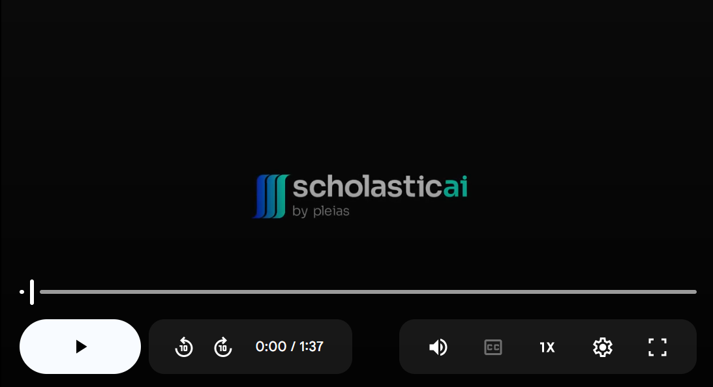

# ScholasticAI




**ScholasticAI** is a versatile tool designed for **retrieval-augmented generation (RAG)**. It allows you to upload and analyze local PDFs, retrieve precise information and use generative AI to produce answers based on high fidelity quotes from your documents, as well as querying external knowledge databases, like the 250M+ documents OpenAlex. At the heart of this application we can find **pleias-Pico (350m)**, member of the family of **Pleias's own AI foundation models**, which are **SoTA small models for RAG**, **European AI Act compliant** and most importantly **completely open** (weights, corpus and code).

**No GPU? No problem!**, the app was made under the philosphy of **complete local deployement**, running efficiently on consumer grade **GPU-less** laptops or desktops, achievaible by using our performant, lightweight models. While we built this application mainly for working with research articles, you can use it for treating different kinds of PDFs.

**ScholasticAI** can run in systems having at least these specs:

- OS : Windows - MacOS
- Ryzen 5 3000 series processor , Intel Core i5 series (8th gen), Apple M1 Processor
- 8GB of Ram


We are very grateful to the **Mozilla foundation** (Mozilla Local AI Builders program, https://builders.mozilla.org/ ), who supported the development of this application.

### Table of Contents

1. [How to Use the App](#1-how-to-use-the-app)
    - [Step 1: Clone the Repository](#step-1-clone-the-repository)
    - [Step 2: Download and Load the Model](#step-2-download-and-load-the-model)
    - [Step 3: Install Dependencies](#step-3-install-dependencies)
    - [Step 4: Run the Application](#step-4-run-the-application)
2. [Working with the App](#2-working-with-the-app)
3. [Model](#3-model)
    - [Description](#description)
    - [Training](#training)
4. [Remarks](#4-remarks)
    - [First time use](#first-time-use)
    - [Bright mode](#bright-mode)
    - [CPU usage](#cpu-usage)
5. [Attribution](#5-attribution)


---

## 1. How to Use the App

### Step 1: Clone the Repository
```bash
git clone https://github.com/Pleias/pleias_ScholasticAI
cd pleias_ScholasticAI
```

### Step 2: Download and Load the Model
1. Download the **llamafile executable** (v0.8.13):
   ```bash
   wget https://github.com/Mozilla-Ocho/llamafile/releases/download/0.8.13/llamafile-0.8.13
   chmod +x llamafile-0.8.13
   ```
2. Download the **pleias-Pico(350M) model**:
   - [Model Link](https://huggingface.co/PleIAs/Pleias-Pico)
   - [GGUF version] (https://huggingface.co/PleIAs/Pleias-Pico-GGUF)

3. Load the model locally:
   ```bash
   ./llamafile-0.8.13 -m pleias_pico_bf16.gguf -c 2048 --server --nobrowser # adapt using your local paths
   ```
   - This will create a local API endpoint, accesible at `http://127.0.0.1:8080`.


> Note: our implementation relies on [llamafiles](https://github.com/Mozilla-Ocho/llamafile) and Pleias's models. You can find the full list of available PLeias models [here](https://huggingface.co/collections/PleIAs/common-models-674cd0667951ab7c4ef84cc4). 

### Step 3: Install Dependencies
```bash
pip install -r requirements.txt
```

### Step 4: Run the Application
```bash
python -m src.main
```
**Important** Due to the specialized nature of the training applied to our model, we suggest to always generate answers using a temperature of 0 (default parameter), in order to get results of the best quality. 

---

## 2. Working with the App

[](https://drive.google.com/file/d/1SpkTgavgOls3yITKPOPGqRmYL8u6tMm_/view?usp=sharing)

---


## 3. Model
**Pleias-Pico 0.1** is a specialized 350m parameters language model designed by PleIAs for Retrieval-Augmented Generation.

Similarly to its base model, Pleias-350m, Pleias-Pico 0.1 aims to be a fully open model (weights, code, data), only trained on content with a permissible license and fully compliant with the European AI Act.

### Description
PleIAs-Pico is continuous pretraining of Pleias-350m on a new dataset of 45,088,768,000 tokens modeling common retrieval tasks. All the content of the dataset is ultimately coming from Common Corpus.

Pleias-Pico includes the main features of the original base model:
* Only trained on open data under a permissible license and in compliance with the European AI Act. By design, all Pleias model are unable to output copyrighted content.
* Extensive multilingual support for main European languages: English, French, German, Spanish, Italian, Dutch, Latin, Portuguese and Polish.
* Extremely low level of toxicity and problematic content.

Pleias-Pico supports retrieval-augmented generation with enhanced verifiability, source analysis and grounding on submitted sources. This includes:
* Standardized structure and special tokens to include queries, sources, references.
* Anticipation of various query forms in multiple languages, from actual drafted questions to unstructured list of keyword search.
* Source analysis/criticism which also acts as an integrated reranker step.
* Generation of ground answers with references and excerpts linked to the original sources.

Given its small size (350m), Pleias-Pico 0.1 was originally conceived as an experimental model. 

Initial tests have shown that the RAG design has significantly improved the factuality and verifiability of the model. Even when the grounding does not work perfectly, the information remains much closer to the original sources.

### Training
PleIAs-Pico was trained at Jean-Zay with 16 h100s with Nanotron, the pretraining library from HuggingFace. 

PleIAs-Pico derives from the last checkpoint of PleIAs-350m (518,000). The training schedule reused the last learning rate value (6e-5) without decay for 90,000 steps.

Training covers the entire RAG dataset we have been designing out of Common Corpus for 1 epoch.

Further experiments were made with different learning rate values: none of theses tests have provided a better convergence than the one obtained with the final learning rate from the base model.

As a specialized language model, PleIAs-Pico will be unable to work properly with prompts that detracts from that design.


---

## 4. Remarks
### First time use
- If you launch the app for the first time, the BGE-M3 model for embedding will be downloaded. This should not take more than a few minutes depending on your internet connection. 
- Once initialized, you can:
  - Upload PDFs to the app.
  - Ask questions in the chat window.
  - Load additional documents at any time.

### Bright mode
- ScholasticAI was designed for the bright mode for the moment. We strongly recommend you switch your laptop to bright mode before launching the app.


### CPU Usage
This application is optimized to run on CPU-only for local use. Running multiple other applications simultaneously may slow it down.

---


## 5. Attribution

This app leverages open-source tools and models, including:
- **pleIAs-pico(350m)**: A retrieval-augmented generation language model designed by Pleias.
- **llamafile**: Model loader and API server for efficient local inference.
- **YOLOv8**: We use a fine-tuned version of this visual model for layout analysis.

All models and tools are designed to comply with the **European AI Act** and respect open licensing standards.
